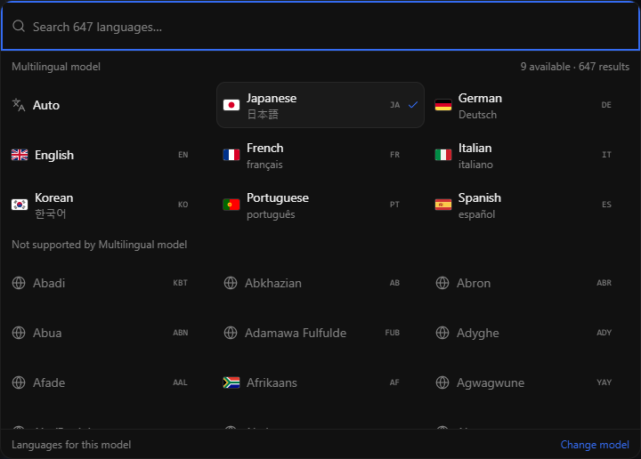

# Language selection

The Electron language picker shows a representative flag (or globe), localized name,
native name when different, and language code. Search matches all names and codes,
the representative flag's country name/code, and flag emoji,
ignores case and accents, and runs locally without a typing delay or network requests.
The selected value remains the existing canonical language name in projects and requests.

The screenshot uses fixture model metadata to demonstrate both enabled and disabled rows.

## Selection and accessibility

The popup adapts to one, two or three columns. Auto and up to four recent enabled
choices lead the list; remaining enabled languages precede unavailable languages.
Unavailable results remain searchable and have a model-specific disabled explanation.
Recents stay on this device and never override model support.

Opening focuses search. Up/Down follow reading order across enabled choices; Enter
selects and Escape cancels. Alt+Left/Right also navigate, respecting RTL; ordinary
Left/Right and Home/End keep their native text-editing behavior. IME confirmation
does not select a language. Closing restores focus; Tab exits the popup.
The list exposes selected/disabled states, result counts, positions and total size.
Virtualization keeps the active option mounted even when scrolled outside the viewport.

## Model compatibility

Clone, Design, Stories, Audiobook, Batch Dub and dub segment output pickers use
the selected TTS model's declared language names. Source recordings, translation
targets and existing dub track navigation remain independent of TTS; the shared
search surface improves those pickers too. A saved incompatible language stays
visible with a warning rather than being silently changed. Known incompatible local
requests are checked before clone/design, long-form, batch and dub synthesis;
engine-side validation remains authoritative.

Finite engines use their adapter's language declarations. Native OmniVoice adapters
use the bundled language vocabulary. MLX-Audio Kokoro reads literal language tables
from its installed package without importing MLX or loading weights. Missing/custom
metadata is explicitly unknown, not a claim of universal support. Worker language
metadata is not yet advertised by the runtime API, so local lists never restrict a
remote worker. Loading and failed discovery have separate labels. No models are
downloaded or switched by selecting a language. Auto retains each engine's existing
automatic/default behavior; it does not add support for another language.

## Maintenance and validation

`SearchableSelect` owns an opt-in virtualized surface; existing classic consumers
retain their behavior. `language-codes.json` mirrors `LANG_NAME_TO_ID` and is guarded
by a backend parity test. User-facing labels live in both Electron locale trees.

Run picker, language-options, TTS-language and affected generation unit tests;
`tests/test_engine_language_options.py` with `HF_HUB_OFFLINE=1` and an empty cache;
Electron typecheck and locale checks. `electron/tests/language-picker-smoke.mjs`
checks browser layout, flags, focus return, disabled selection, active-option mounting,
and measures filtering with English/German/Arabic and desktop platform bridge fixtures.
Set `VOICESTUDIO_UI_URL` to the smoke server and optionally `PLAYWRIGHT_CHANNEL`.
These bridge fixtures do not replace native OS or manual screen-reader testing.

Partial dub regeneration checks the selected segments in the renderer. The backend
validates its final local render set, including segments promoted because their
cache is missing, corrupt or from an incompatible timing format, before synthesis.
